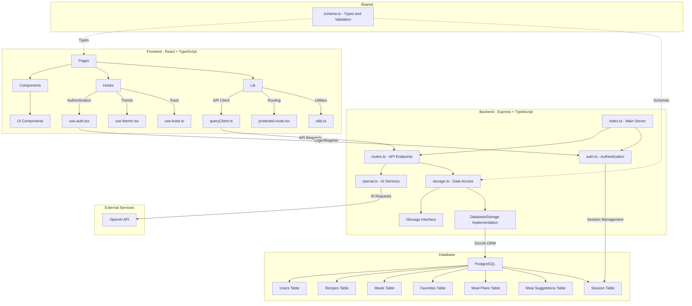
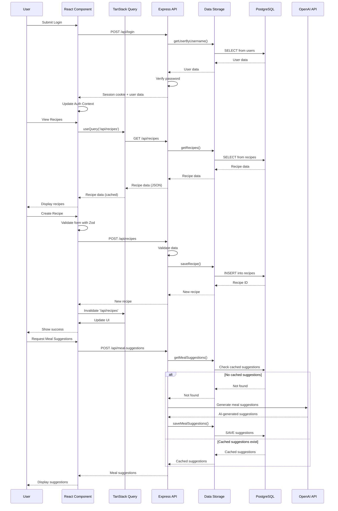
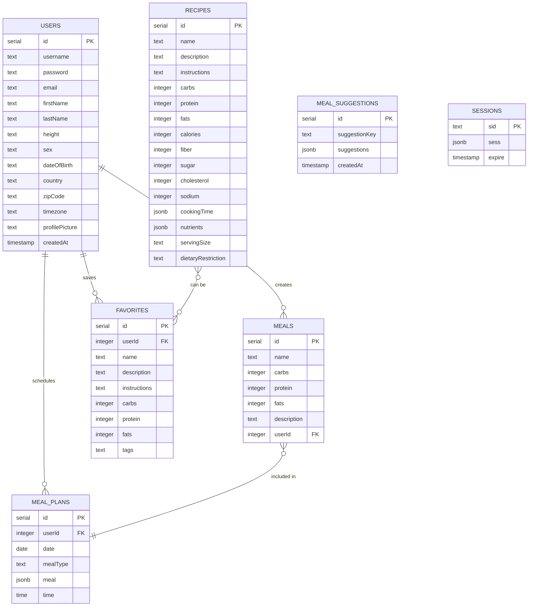

# SmartEats Architecture Diagram

```mermaid
graph TD
    subgraph "Frontend - React + TypeScript"
        A[Pages] --> B[Components]
        B --> C[UI Components]
        A --> D[Hooks]
        D -->|Authentication| E[use-auth.tsx]
        D -->|Theme| F[use-theme.tsx]
        D -->|Toast| G[use-toast.ts]
        A --> H[Lib]
        H -->|API Client| I[queryClient.ts]
        H -->|Routing| J[protected-route.tsx]
        H -->|Utilities| K[utils.ts]
    end

    subgraph "Backend - Express + TypeScript"
        L[index.ts - Main Server] --> M[routes.ts - API Endpoints]
        L --> N[auth.ts - Authentication]
        M --> O[openai.ts - AI Services]
        M --> P[storage.ts - Data Access]
        P --> Q[IStorage Interface]
        P --> R[DatabaseStorage Implementation]
    end

    subgraph "Shared"
        S[schema.ts - Types and Validation]
    end

    subgraph "Database"
        T[PostgreSQL]
        T --> U[Users Table]
        T --> V[Recipes Table]
        T --> W[Meals Table]
        T --> X[Favorites Table]
        T --> Y[Meal Plans Table]
        T --> Z[Meal Suggestions Table]
        T --> AA[Session Table]
    end

    subgraph "External Services"
        AB[OpenAI API]
    end

    %% Frontend to Backend Communication
    I -->|API Requests| M
    
    %% Backend to Database
    R -->|Drizzle ORM| T
    
    %% Backend to External Services
    O -->|AI Requests| AB
    
    %% Shared Types
    S -.->|Types| A
    S -.->|Schemas| P
    
    %% Authentication Flow
    E -->|Login/Register| N
    N -->|Session Management| AA
```

## Data Flow Diagram

```mermaid
sequenceDiagram
    participant User
    participant React as React Component
    participant Query as TanStack Query
    participant API as Express API
    participant Storage as Data Storage
    participant DB as PostgreSQL
    participant AI as OpenAI API
    
    %% Authentication Flow
    User->>React: Submit Login
    React->>API: POST /api/login
    API->>Storage: getUserByUsername()
    Storage->>DB: SELECT from users
    DB-->>Storage: User data
    Storage-->>API: User data
    API->>API: Verify password
    API-->>React: Session cookie + user data
    React->>React: Update Auth Context
    
    %% Recipe Fetching
    User->>React: View Recipes
    React->>Query: useQuery('/api/recipes')
    Query->>API: GET /api/recipes
    API->>Storage: getRecipes()
    Storage->>DB: SELECT from recipes
    DB-->>Storage: Recipe data
    Storage-->>API: Recipe data
    API-->>Query: Recipe data (JSON)
    Query-->>React: Recipe data (cached)
    React-->>User: Display recipes
    
    %% Creating Recipe
    User->>React: Create Recipe
    React->>React: Validate form with Zod
    React->>API: POST /api/recipes
    API->>API: Validate data
    API->>Storage: saveRecipe()
    Storage->>DB: INSERT into recipes
    DB-->>Storage: Recipe ID
    Storage-->>API: New recipe
    API-->>React: New recipe
    React->>Query: Invalidate '/api/recipes'
    Query->>React: Update UI
    React-->>User: Show success
    
    %% Meal Suggestion with AI
    User->>React: Request Meal Suggestions
    React->>API: POST /api/meal-suggestions
    API->>Storage: getMealSuggestions()
    Storage->>DB: Check cached suggestions
    alt No cached suggestions
        DB-->>Storage: Not found
        Storage-->>API: Not found
        API->>AI: Generate meal suggestions
        AI-->>API: AI-generated suggestions
        API->>Storage: saveMealSuggestions()
        Storage->>DB: SAVE suggestions
    else Cached suggestions exist
        DB-->>Storage: Cached suggestions
        Storage-->>API: Cached suggestions
    end
    API-->>React: Meal suggestions
    React-->>User: Display suggestions
```

## Component Architecture

```mermaid
graph TD
    subgraph "Client Pages"
        A1[home.tsx]
        A2[auth.tsx]
        A3[recipes.tsx]
        A4[planner.tsx]
        A5[calendar.tsx]
        A6[favorites.tsx]
        A7[profile.tsx]
        A8[pantry.tsx]
        A9[camera.tsx]
    end

    subgraph "Shared Components"
        B1[Navigation]
        B2[Footer]
        B3[ChatBot]
        B4[ThemeSettings]
    end

    subgraph "UI Components"
        C1[RecipeCard]
        C2[RecipeModal]
        C3[Calendar]
        C4[CameraInput]
        C5[Form Components]
        C6[Toast/Alert Components]
    end

    subgraph "Layout Components"
        D1[ProtectedRoute]
        D2[App Layout]
    end

    %% Connections
    A1 & A2 & A3 & A4 & A5 & A6 & A7 & A8 & A9 --> B1
    A1 & A2 & A3 & A4 & A5 & A6 & A7 & A8 & A9 --> B2
    A3 --> C1
    A3 --> C2
    A5 --> C3
    A9 --> C4
    A2 & A3 & A4 & A5 & A6 & A7 & A8 --> C5
    A1 & A2 & A3 & A4 & A5 & A6 & A7 & A8 & A9 --> C6
    A3 & A4 & A5 & A6 & A7 & A8 & A9 --> D1
```

## Database Schema

```mermaid
erDiagram
    USERS {
        serial id PK
        text username
        text password
        text email
        text firstName
        text lastName
        text height
        text sex
        text dateOfBirth
        text country
        text zipCode
        text timezone
        text profilePicture
        timestamp createdAt
    }

    RECIPES {
        serial id PK
        text name
        text description
        text instructions
        integer carbs
        integer protein
        integer fats
        integer calories
        integer fiber
        integer sugar
        integer cholesterol
        integer sodium
        jsonb cookingTime
        jsonb nutrients
        text servingSize
        text dietaryRestriction
    }

    MEALS {
        serial id PK
        text name
        integer carbs
        integer protein
        integer fats
        text description
        integer userId FK
    }

    FAVORITES {
        serial id PK
        integer userId FK
        text name
        text description
        text instructions
        integer carbs
        integer protein
        integer fats
        text tags
    }

    MEAL_PLANS {
        serial id PK
        integer userId FK
        date date
        text mealType
        jsonb meal
        time time
    }

    MEAL_SUGGESTIONS {
        serial id PK
        text suggestionKey
        jsonb suggestions
        timestamp createdAt
    }

    SESSIONS {
        text sid PK
        jsonb sess
        timestamp expire
    }

    USERS ||--o{ MEALS : "creates"
    USERS ||--o{ FAVORITES : "saves"
    USERS ||--o{ MEAL_PLANS : "schedules"
    MEALS }o--|| MEAL_PLANS : "included in"
    RECIPES }o--o{ FAVORITES : "can be"
```